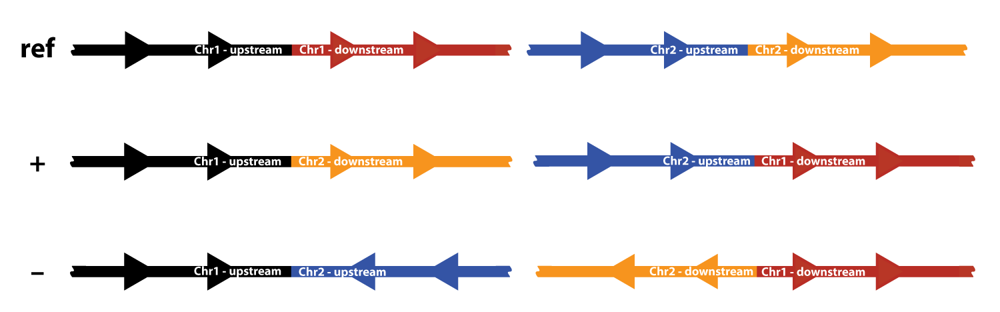

Command line interface
======================

Loading and visualizing your structural variant
-----------------------------------------------

To visualize your structural variant of interest, you will need at least the following three pieces of data:

1. Input bam file(s). This bam file must be coordinate-sorted and have an index file (sample.bam.bai) in the same directory. You can use `samtools <http://www.htslib.org/download>`_ to sort and index your bam file. Bam files are specified using the ``-b`` command line argument, which can be provided multiple times to load and visualize multiple samples simultaneously.
2. Input genome fasta file. If a .fai index file does not already exist in the directory containing the fasta file, it will be created. This means that, if the .fai file does not already exist, the fasta file needs to be in a directory for which you have write permission. This fasta file is the first required command line argument.
3. The coordinates of the structural variant. The type of event is specified by the ``-t`` command line option. The following four event types are currently supported:
    
    :Deletions: The format for specifying deletion breakpoints is ``chrom start end``.
    :Inversions: To specify an inverted region, use ``chrom start end``.
    :Insertions: The format for specifying insertions is ``chrom breakpoint <inserted sequence>``.
    :Mobile elements: Mobile element insertions can be specified by ``<mobile_elements.fasta> <chrom> <pos> <ME name> [ME strand [start [end]]]``, where ``<ME name>`` must match the header line from the mobile_elements.fasta file, and strand, start and end are optional coordinates of the relevant portion from the mobile element sequence.
    :Translocations: Translocations can be specified using the following format: ``chrom1 pos1 chrom2 pos2 orientation``, where ``orientation`` is either ``+`` or ``-``, and specifies whether region1 and region2 are both on the plus strand of the genome, or are on opposite genomic strands; and pos1 and pos2 are the chromosomal coordinates of the breakpoints. See :ref:`below <breakends>` for more info.
    :Breakend: Additional types of structural variant can be specified using `breakend <http://samtools.github.io/hts-specs/VCFv4.2.pdf>`_ format: ``chrom1 pos1 strand1 chrom2 pos2 strand2``. Note that, due to limitations of the Smith-Waterman alignment library used by svviz, breakend breakpoints must be distant from one another, relative to the insert size/read length. See :ref:`below <breakends>` for more info.
    :Batch: see :ref:`here <batch-mode>`

For example, a deletion might be called as:

.. code-block:: bash

    svviz -t del -b sample1.sorted.bam -b sample2.sorted.bam hg19.fasta chr7 153757067 153758235

Displaying annotations
----------------------

Annotation tracks can be loaded and visualized in order to display the position of important nearby genomic regions such as genes or repeat sequences. These need to be provided in standard `BED <http://genome.ucsc.edu/FAQ/FAQformat.html#format1>`_ format (the first 6 columns are required, up to and including strand). Such annotation tracks can easily be downloaded from the `UCSC Genome Browser <http://genome.ucsc.edu>`_, either from the standard annotations provided for each assembly or using their Table Browser tool. Each bed file is specified with the ``--annotations`` option (or ``-A``).

Exporting visualizations
------------------------

The visualizations can be exported to SVG, PNG or PDF from the web view by clicking the "Export" link at the top of the web view. Alternatively, these files can be created directly, without launching the web interface, using the ``--export`` option (and this exported image file can be opened automatically using your system-defined image viewer by additionally specifying the ``--open-exported`` or ``-O`` option).

SVG is svviz's native format and requires no additional software. Export to PNG or PDF requires either librsvg or Inkscape (see the :ref:`installation instructions <installation>` for more info). An option for PDF export on OS X only is webkitToPDF. When multiple conversion backends are installed, you can specify which one is used to convert to PDF/PNG using the ``--converter`` command line option. For example, add the option ``--converter inkscape`` to specify that conversion should use Inkscape instead of one of the other backends. If this option is not specified, svviz will automatically pick from the installed backends.

Additional options
------------------

The default settings are typically correct for Illumina data. Read orientation and insert sizes will be inferred for each input library. Sequencing platforms that have a substantially higher error rate than Illumina may need adjusting of the ``--aln-quality`` and the ``--aln-score-delta`` options.

The ``--lenient`` option is recommended for pacific biosciences sequencing (because PacBio sequencing is typically of lower base-quality than Illumina sequencing, this preset changes the ``--aln-quality`` option to retain lower quality alignments as support for the Ref and Alt alleles; and this also changes the ``--aln-score-delta`` to only assign a read to an allele if the difference in alignment scores exceeds a threshold relative to a fraction of the read length, rather than a small fixed value). 

The ``--min-mapq`` option specifies the mapping quality threshold; reads with mapq (this is set during the original genome-wide mapping by bwa, bowtie, etc) below this threshold will be discarded during pre-processing. A similar argument, ``--pair-min-mapq``, can be used instead to require that at least one read end out of a read pair must have a mapq exceeding this value (this read end must be near the variant being analyzed).

.. _dotplots:

The ``--dotplots`` option will create a `dotplot <https://en.wikipedia.org/wiki/Dot_plot_(bioinformatics)>`_ to visualize sequence similarity within the genomic region(s) surrounding the structural variant. This depends on the optional python package rpy2 (first make sure `R <https://www.r-project.org>`_ is installed and then install rpy2 using the command ``sudo pip install rpy2``). You will also need to install `yass  <http://bioinfo.lifl.fr/yass>`_, which can be installed using the `homebrew <http://brew.sh>`_ command ``brew install homebrew/science/yass`` (OS X only) or yass can be downloaded, compiled and installed according to the instructions `here <http://bioinfo.lifl.fr/yass/download.php>`_ (linux and OS X).

The dotplot output shows regions of similarity within the reference allele as lines: blue lines indicate similarity on the same strand and direction whereas red indicates similarity on the opposite strand/direction. Because the similarity matrix is symmetrical, only same strand similarities are shown in the upper left half and only opposite strand similarities are shown in the bottom right half. The structural variant breakpoints are shown as dashed gray lines.

.. _multimapping:

A related option is ``--max-multimapping-similarity``, which adjust how aggressively svviz filters out reads that potentially align to multiple locations near the structural variant. The default score of 0.95 means that any read (for paired-end reads, this means any read-end) whose second-best alignment score is more than 0.95 times the best alignment score will be assigned as ambiguous. For example, if the best alignment score is 445, and the second-best alignment score is 439, the multimapping similarity would be 439/445=0.99 and the read would be marked as ambiguous. However, a read whose best alignment score is 445 but second-best alignment score is 405 would not be filtered because the multimapping similarity of 395/445=0.89 is less than 0.95.

.. _breakends:

Translocations and Breakends
----------------------------

Complex variants (first introduced :ref:`here <complex_variants>`) can be visualized using the translocation or breakend event types (specify event type using the command line options ``--type tra`` or ``--type bkend``). Two possible orientations are possible for a translocation, "+" and "--":

    Possible orientations for a translocation event.

The top row shows the two reference chromosomes; for each chromosome, a region upstream and a region downstream of the breakpoint is shown in different colors. There are two possible fusion chromosomes for the "+" orientation. In the first, the upstream half of chromosome 1 (black) is fused to the downstream half of chromosome 2 (orange). In the second, reciprocal event, the upstream chromosome 2 half (blue) is fused to the downstream chromosome 1 half (red).

The "--" orientation works similarly, but here the plus strand of one chromosome is fused to the minus strand of the other chromosome.

For example, if the breakpoints were located at chr1:32,456,789 and chr2:12,468,579, then the "+" orientation event would be specified as ``chr1 32456789 chr2 12468579 +`` and the "--" orientation event would be specified as ``chr1 32456789 chr2 12468579 -``. Remember to use ``--type tra``.

svviz always shows both reciprocal halves of a translocation -- if the translocation was not reciprocal, then reads should only support one fusion and not the other. To analyze only a single fusion, use the more general purpose breakend event type.

The breakend event type (``--type bkend``) takes two genomic locations and analyzes the structural variant formed by joining the two genomic regions. A few examples:

- a large deletion: in this case two breakpoints lie distantly on the same chromosome; the alternate allele shows the deletion allele formed by joining the upstream and downstream regions

- an inversion breakpoint: again, the two breakpoints lie on the same chromosome; the alternate allele shows the joining of two distant regions originally on the same strand but now head-to-head on opposite strands (note that the two inversion breakpoints must be analyzed separately using the breakend event type; the built-in inversion type analyzes both breakpoints simultaneously)

- a translocation: as mentioned above, the breakend event type can be used to show a single chromosomal fusion (rather than both reciprocal events)

For example, the four fusions shown in the figure above would be specified as follows in breakend format:

- ``chr1 32456789 + chr2 12468579 +`` (top-left)
- ``chr2 12468579 + chr1 32456789 +`` (top-right)
- ``chr1 32456789 + chr2 12468579 -`` (bottom-left)
- ``chr2 12468579 - chr1 32456789 +`` (bottom-right)

