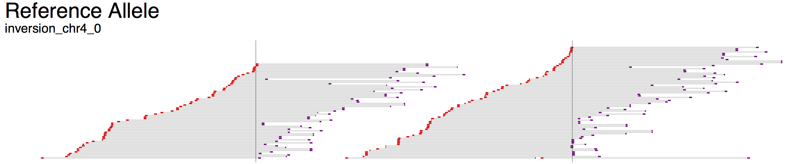
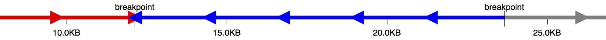
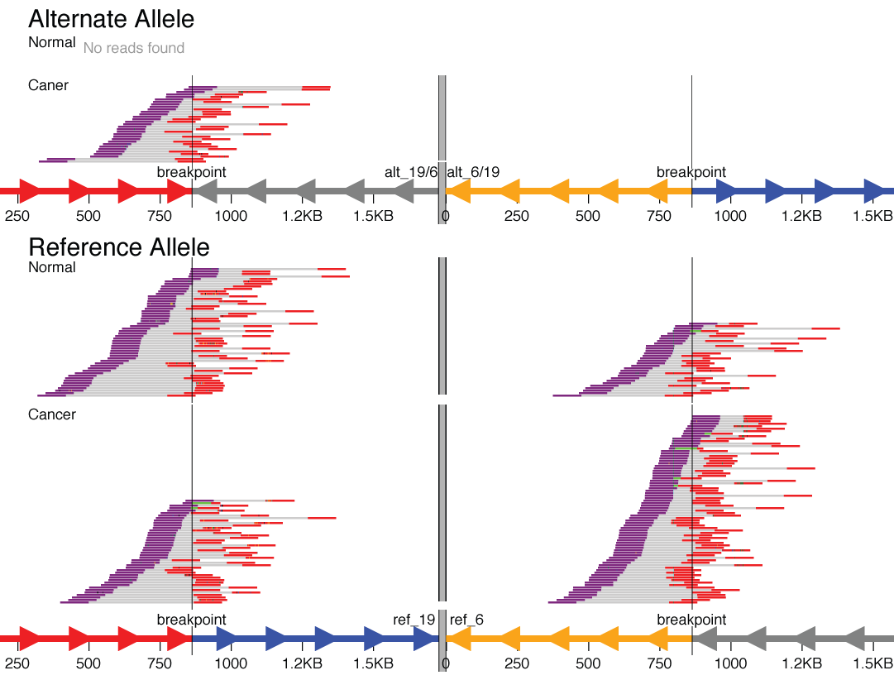

Visual output
=================

The visualizations produced by svviz are split into several sections. The top shows some information about the structural variant that is being visualized, including type and genomic coordinates, as well as summaries of read counts in each category.

    Example view of the reference allele. Breakpoints are indicated by thin vertical lines.

Below the overview information, the visualization is split into three parts: "Alt", "Ref" and "Amb" (the ambiguous track is only shown in the web view and not in the exported visualizations). Reads aligning better to the alternate allele than the reference allele will be shown in the first set of tracks, whereas those aligning better to the reference allele will be shown in the middle set of tracks.

At the bottom (web view only), in the "Amb" section, are reads that align poorly to both alleles, or equally well to both alleles, and hence do not provide evidence for or against the structural variant being analyzed. These reads are shown aligned against the reference sequence, and typically include reads that map near the structural variant breakpoints but do not map across the breakpoints.

An axis is shown below each section, showing the scale in basepairs, as well as indicating the positioning of the breakpoints and the orientation of each region between breakpoints (large arrows). Coloring of the segments is consistent between Alt, Ref and Amb sections.

    Axis for inversion on chromosome 4 (Alt allele).

For example, the first demonstration (``svviz demo``), which analyzes an inversion on chromosome 4, displays three colored bars: red, blue and then grey. The blue segment in the middle indicates the inverted region, and hence the arrows point to the left in the Alt section but to the right in the Ref section. Breakpoints are indicated as vertical lines through all the tracks.

Reads aligning to the minus strand are colored red and those aligning to the plus strand are colored purple. Unsequenced space between read pairs is shown by light gray bars. Overlapping portions of read pairs are shown in a light green color (for example, if the insert size is 250 and 2x150bp sequencing was performed, the middle 50bp would be sequenced from both reads). Mismatches to the sequence of the allele (for example due to single nucleotide polymorphisms or sequencing errors) are shown as colored vertical bars with the width of a nucleotide (ie, you will probably need to zoom in to see them).

Web interface
-------------

In the interactive web view, zooming can be accomplished by clicking the plus or minus buttons, or by holding down the option (Mac) or alt (linux) key and spinning the scroll wheel while hovering over a track. If you hover your mouse over a read, the nucleotide-level alignment(s) will be shown for the read (or read-pair), along with some information about the length of the aligned read (or read pairs) and the reason the read (pair) was assigned to a given allele.

Scrolling using the scroll-wheel or panning by clicking and dragging pans all tracks simultaneously, whereas using the vertical scrollbars only scrolls the track of interest. Horizontal scrolling can also be performed using the scroll wheel by holding down shift.

To stop running the locally-hosted server and quit python, press ctrl-c in the terminal window. Any web views you have open will still show the reads, but information will no longer be updated when you hover your mouse over a read.

.. _complex_variants:

Complex variants
----------------

For some structural variant types, the breakpoints are distant in the genome (in the extreme, they fall on entirely different chromosomes). An example might be a translocation between chromosome 6 and chromosome 19. To visualize these types of events, svviz visualizes each breakpoint region in a separate "chromosome part", which are then separated visually by a thick gray line.

    A translocation between chromosomes 6 and 19 that was found only in the cancer sample but not the matched normal sample.

Here, in the reference allele, you can see the chromosome 19 part colored red (upstream of breakpoint) and blue (downstream of breakpoint). The chromosome 6 part is shown in reverse orientation (indicated by axis arrows pointing left), with the segments colored gray (upstream) and yellow (downstream). Reads are shown tiling nicely across both breakpoints in both the cancer and matched normal sample.

The alternate allele shows the fusion of the red upstream chromosome 19 segment with the gray upstream segment of chromosome 6. Reads tile across this translocation breakpoint in the cancer but not the normal sample (here, this is a fusion of two genic regions in the intronic regions; nearby genes can be shown using bed/gff format gene annotations). Note also that the reciprocal event (the yellow/blue fusion) is shown but with zero supporting reads.